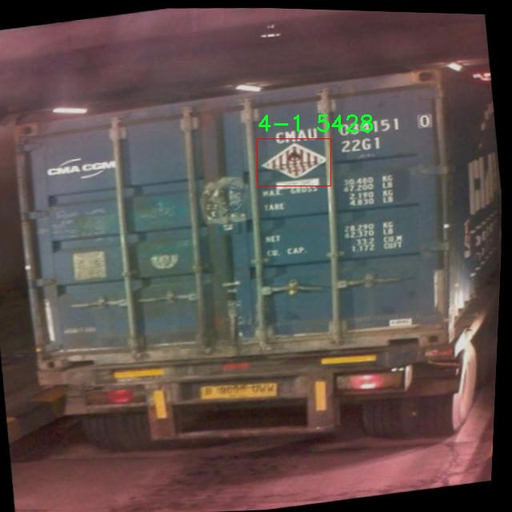
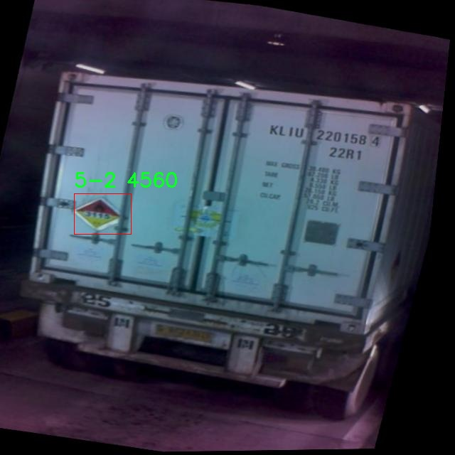

# 危险品容器标签识别系统源码分享
 # [一条龙教学YOLOV8标注好的数据集一键训练_70+全套改进创新点发刊_Web前端展示]

### 1.研究背景与意义

项目参考[AAAI Association for the Advancement of Artificial Intelligence](https://gitee.com/qunmasj/projects)

项目来源[AACV Association for the Advancement of Computer Vision](https://kdocs.cn/l/cszuIiCKVNis)

研究背景与意义

随着全球化进程的加快，危险品的运输和存储在现代社会中变得愈发普遍。然而，危险品的管理和识别依然是一个亟待解决的重要问题。根据国际海事组织（IMO）的统计，全球每年因危险品泄漏和事故造成的经济损失和环境污染数以亿计。为了降低这些风险，准确、快速地识别危险品容器上的标签信息显得尤为重要。传统的人工识别方法不仅效率低下，而且容易受到人为因素的影响，导致识别错误。因此，开发一种高效、准确的自动化识别系统成为了研究的热点。

在这一背景下，计算机视觉技术的迅猛发展为危险品标签的自动识别提供了新的解决方案。YOLO（You Only Look Once）系列模型作为一种高效的目标检测算法，因其实时性和高准确率而广泛应用于各类视觉识别任务。YOLOv8作为该系列的最新版本，进一步提升了检测精度和速度，适合在复杂环境中进行危险品标签的识别。通过对YOLOv8进行改进，可以针对危险品容器标签的特征进行优化，从而提高系统的整体性能。

本研究将基于改进的YOLOv8模型，构建一个危险品容器标签识别系统。所使用的数据集包含908张图像，涵盖20个类别，其中包括腐蚀性、爆炸性、易燃液体等多种危险品类型。这些类别的标签不仅具有重要的安全意义，还涉及到法律法规的合规性。因此，系统的准确识别将直接影响到危险品的运输安全和环境保护。

通过对数据集的深入分析，我们发现标签的多样性和复杂性为识别系统的构建带来了挑战。每个类别的标签设计和图像特征各不相同，且在实际应用中，标签可能因磨损、污垢或遮挡而变得难以识别。因此，改进YOLOv8模型的特征提取能力和鲁棒性，成为提升识别准确率的关键。此外，结合深度学习技术的迁移学习和数据增强方法，可以有效提高模型在小样本数据集上的表现，进而增强系统的实用性。

本研究的意义不仅在于技术层面的创新，更在于其对社会安全和环境保护的积极影响。通过建立高效的危险品标签识别系统，可以大幅提升危险品管理的自动化水平，降低人为错误的发生概率，从而为危险品的安全运输和存储提供有力保障。同时，该系统的成功应用还可以为其他领域的目标检测任务提供借鉴，推动计算机视觉技术在更广泛的场景中的应用。因此，本研究具有重要的理论价值和实际意义，为未来的危险品管理提供了新的思路和方法。

### 2.图片演示


##### 注意：由于此博客编辑较早，上面“2.图片演示”和“3.视频演示”展示的系统图片或者视频可能为老版本，新版本在老版本的基础上升级如下：（实际效果以升级的新版本为准）

  （1）适配了YOLOV8的“目标检测”模型和“实例分割”模型，通过加载相应的权重（.pt）文件即可自适应加载模型。

  （2）支持“图片识别”、“视频识别”、“摄像头实时识别”三种识别模式。

  （3）支持“图片识别”、“视频识别”、“摄像头实时识别”三种识别结果保存导出，解决手动导出（容易卡顿出现爆内存）存在的问题，识别完自动保存结果并导出到tempDir中。

  （4）支持Web前端系统中的标题、背景图等自定义修改，后面提供修改教程。

  另外本项目提供训练的数据集和训练教程,暂不提供权重文件（best.pt）,需要您按照教程进行训练后实现图片演示和Web前端界面演示的效果。

### 3.视频演示

[3.1 视频演示](https://www.bilibili.com/video/BV1Fv2gY9EqJ/)

### 4.数据集信息展示

##### 4.1 本项目数据集详细数据（类别数＆类别名）

nc: 20
names: ['10', '11', '2-1', '2-2', '2-3', '3-1', '4-1', '4-2', '4-3', '5-1', '5-2', '6-1', '7-2', '8-1', '9-1', 'corrosive', 'explosive', 'flammable_liquid', 'miscellaneous', 'toxic']


##### 4.2 本项目数据集信息介绍

数据集信息展示

在当今工业和运输领域，危险品的安全管理至关重要。为了提高危险品容器标签的识别精度，我们构建了一个名为“container danger sticker”的数据集，旨在为改进YOLOv8模型提供丰富的训练素材。该数据集包含20个类别，涵盖了多种危险品的标识符，确保了模型在实际应用中的广泛适用性和准确性。

“container danger sticker”数据集的类别设计充分考虑了不同类型危险品的特性与潜在风险，具体类别包括数字标签和文字标签。数字标签如‘10’，‘11’，‘2-1’，‘2-2’，‘2-3’，‘3-1’，‘4-1’，‘4-2’，‘4-3’，‘5-1’，‘5-2’，‘6-1’，‘7-2’，‘8-1’，‘9-1’等，主要用于标识特定的危险品分类。这些数字标签的使用不仅有助于快速识别和分类危险品，还能在紧急情况下为相关人员提供清晰的指引，降低事故发生的风险。

除了数字标签外，数据集中还包含了与危险品相关的文字标签，如‘corrosive’（腐蚀性）、‘explosive’（爆炸性）、‘flammable_liquid’（易燃液体）、‘miscellaneous’（其他）和‘toxic’（有毒）。这些标签提供了对危险品特性的详细描述，帮助模型在进行图像识别时，能够更好地理解和区分不同类型的危险品。通过对这些标签的学习，YOLOv8模型将能够在复杂的环境中快速、准确地识别出危险品容器，从而为相关行业的安全管理提供有力支持。

数据集的构建过程中，我们注重数据的多样性和代表性，确保每个类别的样本数量充足且具备一定的变异性。这种多样性不仅提升了模型的泛化能力，还增强了其在不同场景下的适应性。例如，腐蚀性和易燃液体的标签可能在不同的容器形态和背景下出现，模型需要能够适应这些变化，以确保在实际应用中不会出现误判或漏判的情况。

在数据集的标注过程中，我们采用了严格的标准，确保每个样本的标签准确无误。所有的标签均由专业人员进行审核，以保证数据集的高质量和可靠性。此外，为了提高模型的训练效率，我们还对数据进行了预处理，包括图像的标准化和增强，确保模型在训练过程中能够充分利用每一个样本的信息。

综上所述，“container danger sticker”数据集为改进YOLOv8的危险品容器标签识别系统提供了坚实的基础。通过对多样化类别的深入学习，模型将能够在复杂的实际环境中实现高效的危险品识别，为安全管理提供更为可靠的技术支持。这一数据集的成功应用，必将推动危险品管理领域的技术进步，提升整体安全水平。







### 5.全套项目环境部署视频教程（零基础手把手教学）

[5.1 环境部署教程链接（零基础手把手教学）](https://www.ixigua.com/7404473917358506534?logTag=c807d0cbc21c0ef59de5)


[5.2 安装Python虚拟环境创建和依赖库安装视频教程链接（零基础手把手教学）](https://www.ixigua.com/7404474678003106304?logTag=1f1041108cd1f708b01a)

### 6.手把手YOLOV8训练视频教程（零基础小白有手就能学会）

[6.1 手把手YOLOV8训练视频教程（零基础小白有手就能学会）](https://www.ixigua.com/7404477157818401292?logTag=d31a2dfd1983c9668658)


按照上面的训练视频教程链接加载项目提供的数据集，运行train.py即可开始训练



     Epoch   gpu_mem       box       obj       cls    labels  img_size
     1/200     20.8G   0.01576   0.01955  0.007536        22      1280: 100%|██████████| 849/849 [14:42<00:00,  1.04s/it]
               Class     Images     Labels          P          R     mAP@.5 mAP@.5:.95: 100%|██████████| 213/213 [01:14<00:00,  2.87it/s]
                 all       3395      17314      0.994      0.957      0.0957      0.0843

     Epoch   gpu_mem       box       obj       cls    labels  img_size
     2/200     20.8G   0.01578   0.01923  0.007006        22      1280: 100%|██████████| 849/849 [14:44<00:00,  1.04s/it]
               Class     Images     Labels          P          R     mAP@.5 mAP@.5:.95: 100%|██████████| 213/213 [01:12<00:00,  2.95it/s]
                 all       3395      17314      0.996      0.956      0.0957      0.0845

     Epoch   gpu_mem       box       obj       cls    labels  img_size
     3/200     20.8G   0.01561    0.0191  0.006895        27      1280: 100%|██████████| 849/849 [10:56<00:00,  1.29it/s]
               Class     Images     Labels          P          R     mAP@.5 mAP@.5:.95: 100%|███████   | 187/213 [00:52<00:00,  4.04it/s]
                 all       3395      17314      0.996      0.957      0.0957      0.0845


### 7.70+种全套YOLOV8创新点代码加载调参视频教程（一键加载写好的改进模型的配置文件）

[7.1 70+种全套YOLOV8创新点代码加载调参视频教程（一键加载写好的改进模型的配置文件）](https://www.ixigua.com/7404478314661806627?logTag=29066f8288e3f4eea3a4)

### 8.70+种全套YOLOV8创新点原理讲解（非科班也可以轻松写刊发刊，V10版本正在科研待更新）

#### 由于篇幅限制，每个创新点的具体原理讲解就不一一展开，具体见下列网址中的创新点对应子项目的技术原理博客网址【Blog】：


[8.1 70+种全套YOLOV8创新点原理讲解链接](https://gitee.com/qunmasj/good)

#### 部分改进原理讲解(完整的改进原理见上图和技术博客链接)【如果此小节的图加载失败可以通过CSDN或者Github搜索该博客的标题访问原始博客，原始博客图片显示正常】
### CBAM空间注意力机制
近年来，随着深度学习研究方向的火热，注意力机制也被广泛地应用在图像识别、语音识别和自然语言处理等领域，注意力机制在深度学习任务中发挥着举足轻重的作用。注意力机制借鉴于人类的视觉系统，例如，人眼在看到一幅画面时，会倾向于关注画面中的重要信息，而忽略其他可见的信息。深度学习中的注意力机制和人类视觉的注意力机制相似，通过扫描全局数据，从大量数据中选择出需要重点关注的、对当前任务更为重要的信息，然后对这部分信息分配更多的注意力资源，从这些信息中获取更多所需要的细节信息，而抑制其他无用的信息。而在深度学习中，则具体表现为给感兴趣的区域更高的权重，经过网络的学习和调整，得到最优的权重分配，形成网络模型的注意力，使网络拥有更强的学习能力，加快网络的收敛速度。
注意力机制通常可分为软注意力机制和硬注意力机制[4-5]。软注意力机制在选择信息时，不是从输入的信息中只选择1个，而会用到所有输入信息，只是各个信息对应的权重分配不同，然后输入网络模型进行计算;硬注意力机制则是从输入的信息中随机选取一个或者选择概率最高的信息，但是这一步骤通常是不可微的，导致硬注意力机制更难训练。因此，软注意力机制应用更为广泛，按照原理可将软注意力机制划分为:通道注意力机制（channel attention)、空间注意力机制(spatial attention）和混合域注意力机制(mixed attention)。
通道注意力机制的本质建立各个特征通道之间的重要程度，对感兴趣的通道进行重点关注，弱化不感兴趣的通道的作用;空间注意力的本质则是建模了整个空间信息的重要程度，然后对空间内感兴趣的区域进行重点关注，弱化其余非感兴趣区域的作用;混合注意力同时运用了通道注意力和空间注意力，两部分先后进行或并行，形成对通道特征和空间特征同时关注的注意力模型。

卷积层注意力模块(Convolutional Block Attention Module，CBAM）是比较常用的混合注意力模块，其先后集中了通道注意力模块和空间注意力模块，网络中加入该模块能有效提高网络性能，减少网络模型的计算量，模块结构如图所示。输入特征图首先经过分支的通道注意力模块，然后和主干的原特征图融合，得到具有通道注意力的特征图，接着经过分支的空间注意力模块，在和主干的特征图融合后，得到同时具有通道特征注意力和空间特征注意力的特征图。CBAM模块不改变输入特征图的大小，因此该模块是一个“即插即用”的模块，可以插入网络的任何位置。

通道注意力模块的结构示意图如图所示，通道注意力模块分支并行地对输入的特征图进行最大池化操作和平均池化操作，然后利用多层感知机对结果进行变换，得到应用于两个通道的变换结果，最后经过sigmoid激活函数将变换结果融合，得到具有通道注意力的通道特征图。

空间注意力模块示意图如图所示，将通道注意力模块输出的特征图作为该模块的输入特征图，首先对输入特征图进行基于通道的最大池化操作和平均池化操作，将两部分得到的结果拼接起来，然后通过卷积得到降为Ⅰ通道的特征图，最后通过sigmoid激活函数生成具有空间注意力的特征图。


### 9.系统功能展示（检测对象为举例，实际内容以本项目数据集为准）

图9.1.系统支持检测结果表格显示

  图9.2.系统支持置信度和IOU阈值手动调节

  图9.3.系统支持自定义加载权重文件best.pt(需要你通过步骤5中训练获得)

  图9.4.系统支持摄像头实时识别

  图9.5.系统支持图片识别

  图9.6.系统支持视频识别

  图9.7.系统支持识别结果文件自动保存

  图9.8.系统支持Excel导出检测结果数据


### 10.原始YOLOV8算法原理

原始YOLOv8算法原理

YOLOv8作为2023年由Ultralytics发布的最新目标检测模型，继承并优化了YOLO系列算法的核心思想，尤其是结合了YOLOX、YOLOv6、YOLOv7和PPYOLOE等多种先进设计理念，展现出更高的检测精度和速度。YOLOv8的设计理念是以实时检测为目标，致力于在保证高效性的同时，提升模型的准确性，尤其在复杂场景下的目标识别能力。该算法的原理可以从其网络结构、特征提取、特征融合以及检测模块等多个方面进行深入分析。

首先，YOLOv8的网络结构由四个主要部分组成：输入层、Backbone骨干网络、Neck特征融合网络和Head检测模块。输入层负责对输入图像进行预处理，包括图像的比例调整、Mosaic增强和瞄点计算等。这些预处理步骤旨在提升模型对多样化输入的适应能力，确保后续特征提取的有效性。

在Backbone部分，YOLOv8采用了经过优化的DarkNet结构，使用C2f模块替代了传统的C3模块。C2f模块的引入使得模型在特征提取时能够获得更丰富的梯度流动信息，同时保持了轻量级特性。这种结构的调整不仅提高了特征提取的效率，还使得模型在处理不同尺度的目标时，能够更好地保留重要的特征信息。此外，YOLOv8还引入了SPPF模块，对输出特征图进行处理，通过不同内核尺寸的池化操作合并特征图，进一步增强了特征的表达能力。

Neck部分的设计采用了“双塔结构”，结合了特征金字塔网络（FPN）和路径聚合网络（PAN）。这种设计的优势在于能够有效促进语义特征和定位特征之间的转移，从而增强网络对不同尺度目标的检测能力。特征金字塔网络通过构建多层次的特征图，确保了模型在不同层次上都能获取到丰富的上下文信息，而路径聚合网络则通过优化特征传递路径，进一步提升了特征融合的效果。

在Head检测模块中，YOLOv8采用了解耦头的结构，将回归分支和预测分支进行分离。这一设计不仅加速了模型的收敛速度，还提高了检测的精度。解耦头的使用使得模型在处理目标检测任务时，能够更灵活地调整各个分支的权重，从而适应不同场景下的检测需求。

值得一提的是，YOLOv8还推出了轻量化版本YOLOv8n，该模型在保持高效性的同时，进一步减少了计算复杂度。YOLOv8n在骨干特征提取网络层使用了更轻量化的C2F模块，采用了3×3的卷积结构，深度则调整为3、6、6、3，显著降低了模型的参数量。在特征融合层，YOLOv8n减少了降采样层的数量，同时用C2F模块替换了C3模块，以提升特征提取的速度和准确性。

YOLOv8n的特征融合网络由特征金字塔网络和路径聚合网络组成，结合了BiFPN网络的设计，进一步提高了模型对不同尺度特征信息的提取速度。BiFPN网络的创新在于其高效的双向跨尺度连接和加权特征融合，通过删除单输入对应的节点，并在同一层的输入输出节点之间添加连接，极大地提升了特征融合的效率和效果。

综上所述，YOLOv8算法通过一系列的结构优化和设计创新，达到了实时检测的新高度。其在特征提取、特征融合和检测模块等方面的改进，使得YOLOv8在目标检测领域展现出强大的能力，尤其在复杂环境下的应用潜力。未来，YOLOv8有望在更多实际场景中得到广泛应用，推动目标检测技术的进一步发展。


### 11.项目核心源码讲解（再也不用担心看不懂代码逻辑）

#### 11.1 code\ultralytics\data\loaders.py

以下是代码中最核心的部分，经过简化和详细注释：

```python
import cv2
import numpy as np
from threading import Thread
from pathlib import Path
from urllib.parse import urlparse

class LoadStreams:
    """
    视频流加载器，支持多种视频流源（如RTSP、RTMP、HTTP等）。
    """

    def __init__(self, sources="file.streams", imgsz=640, vid_stride=1, buffer=False):
        """初始化加载器，设置视频源和相关参数。"""
        self.buffer = buffer  # 是否缓冲输入流
        self.running = True  # 线程运行标志
        self.imgsz = imgsz  # 图像大小
        self.vid_stride = vid_stride  # 视频帧率步长

        # 读取视频源
        sources = Path(sources).read_text().rsplit() if Path(sources).is_file() else [sources]
        self.sources = [self.clean_source(x) for x in sources]  # 清理源名称
        self.caps = [cv2.VideoCapture(s) for s in self.sources]  # 创建视频捕获对象

        # 检查每个视频源是否成功打开
        for i, cap in enumerate(self.caps):
            if not cap.isOpened():
                raise ConnectionError(f"无法打开视频源: {self.sources[i]}")
            # 启动线程读取视频帧
            Thread(target=self.update, args=(i, cap), daemon=True).start()

    def update(self, i, cap):
        """在后台线程中读取视频帧。"""
        while self.running and cap.isOpened():
            success, frame = cap.read()  # 读取帧
            if success:
                # 处理帧（例如，缩放、归一化等）
                frame = cv2.resize(frame, (self.imgsz, self.imgsz))
                # 这里可以添加其他处理逻辑
            else:
                break  # 如果读取失败，退出循环

    def close(self):
        """关闭视频流并释放资源。"""
        self.running = False  # 停止线程
        for cap in self.caps:
            cap.release()  # 释放视频捕获对象

    @staticmethod
    def clean_source(source):
        """清理视频源字符串，去除多余字符。"""
        return source.strip()

    def __iter__(self):
        """返回迭代器以遍历视频帧。"""
        return self

    def __next__(self):
        """返回下一个视频帧。"""
        # 这里可以实现返回当前帧的逻辑
        raise StopIteration  # 示例中不实现具体逻辑

# 示例使用
# loader = LoadStreams(sources='video.mp4')
# for frame in loader:
#     # 处理每一帧
#     pass
```

### 代码核心部分说明：
1. **LoadStreams类**：用于加载和处理视频流，支持多种视频源。
2. **__init__方法**：初始化加载器，设置视频源和相关参数，创建视频捕获对象并启动线程读取视频帧。
3. **update方法**：在后台线程中不断读取视频帧并进行处理。
4. **close方法**：用于关闭视频流并释放资源。
5. **clean_source方法**：清理视频源字符串，去除多余字符。
6. **迭代器方法**：实现了`__iter__`和`__next__`方法，使得`LoadStreams`可以被迭代。

此代码段展示了如何管理视频流的加载和处理，适合用于YOLO等计算机视觉任务。

这个文件是一个用于处理视频流、图像和截图的加载器，主要用于YOLO（You Only Look Once）目标检测模型的输入数据准备。它包含多个类，每个类负责不同类型的数据加载。以下是对代码的逐步分析。

首先，文件导入了一些必要的库，包括`glob`、`math`、`os`、`time`、`dataclasses`、`pathlib`、`threading`、`urllib`、`cv2`、`numpy`、`requests`、`torch`和`PIL`。这些库提供了文件操作、数学计算、图像处理、网络请求等功能。

接下来，定义了一个数据类`SourceTypes`，用于表示输入源的不同类型，如网络摄像头、截图、图像文件和张量等。

`LoadStreams`类用于加载各种类型的视频流，支持RTSP、RTMP、HTTP和TCP流。它的构造函数初始化了一些属性，如输入源、图像大小、视频帧率步幅等。它还会检查输入流的形状是否一致，并为每个源创建一个线程来读取视频帧。`update`方法在后台线程中不断读取视频流的帧，`close`方法用于关闭流并释放资源。`__iter__`和`__next__`方法使得该类可以被迭代，返回源路径、图像和其他信息。

`LoadScreenshots`类用于加载屏幕截图。它的构造函数接收屏幕的相关参数，并使用`mss`库进行屏幕捕获。`__next__`方法会返回捕获的屏幕图像。

`LoadImages`类用于加载图像和视频文件。它的构造函数接受文件路径，支持从文本文件、目录和单个文件加载。该类会根据文件类型区分图像和视频，并在迭代时返回图像或视频帧。

`LoadPilAndNumpy`类用于从PIL和Numpy数组加载图像。它确保输入图像格式正确，并提供迭代功能。

`LoadTensor`类用于从PyTorch张量加载图像。它会验证输入张量的形状和数值范围，并提供迭代功能。

最后，`autocast_list`函数用于将不同类型的输入源合并为Numpy数组或PIL图像的列表。`LOADERS`元组包含了所有的加载器类。

`get_best_youtube_url`函数用于从给定的YouTube视频URL中提取最佳质量的MP4视频流。它可以选择使用`pafy`或`yt_dlp`库来获取视频信息，并返回符合条件的URL。

总体而言，这个文件提供了一整套灵活的输入数据加载机制，支持多种来源的数据，使得YOLO模型可以方便地处理不同类型的输入。

#### 11.2 ui.py

```python
import sys
import subprocess

def run_script(script_path):
    """
    使用当前 Python 环境运行指定的脚本。

    Args:
        script_path (str): 要运行的脚本路径

    Returns:
        None
    """
    # 获取当前 Python 解释器的路径
    python_path = sys.executable

    # 构建运行命令，使用 streamlit 运行指定的脚本
    command = f'"{python_path}" -m streamlit run "{script_path}"'

    # 执行命令
    result = subprocess.run(command, shell=True)
    # 检查命令执行结果，如果返回码不为0，则表示出错
    if result.returncode != 0:
        print("脚本运行出错。")

# 主程序入口
if __name__ == "__main__":
    # 指定要运行的脚本路径
    script_path = "web.py"  # 这里可以直接指定脚本名

    # 调用函数运行脚本
    run_script(script_path)
```

### 代码注释说明：
1. **导入模块**：
   - `sys`：用于获取当前 Python 解释器的路径。
   - `subprocess`：用于执行外部命令。

2. **`run_script` 函数**：
   - 功能：使用当前 Python 环境运行指定的脚本。
   - 参数：`script_path`，要运行的脚本的路径。
   - 过程：
     - 获取当前 Python 解释器的路径，存储在 `python_path` 变量中。
     - 构建一个命令字符串，用于运行 `streamlit` 应用。
     - 使用 `subprocess.run` 执行命令，并检查返回码以判断是否成功。

3. **主程序入口**：
   - 检查是否为主程序运行，如果是，则指定要运行的脚本路径（这里直接指定为 `"web.py"`）。
   - 调用 `run_script` 函数，传入脚本路径以执行该脚本。

这个程序文件名为 `ui.py`，主要功能是通过当前的 Python 环境来运行一个指定的脚本，具体是一个名为 `web.py` 的文件。程序首先导入了必要的模块，包括 `sys`、`os` 和 `subprocess`，以及一个自定义的路径处理函数 `abs_path`，这个函数可能用于获取文件的绝对路径。

在 `run_script` 函数中，首先获取当前 Python 解释器的路径，使用 `sys.executable` 来实现。接着，构建一个命令字符串，该命令使用 `streamlit` 模块来运行指定的脚本。`streamlit` 是一个用于构建数据应用的库，通常用于快速创建交互式网页应用。

随后，程序使用 `subprocess.run` 来执行构建好的命令，`shell=True` 参数表示在一个新的 shell 中执行命令。执行后，程序会检查返回的状态码，如果返回码不为零，说明脚本运行过程中出现了错误，程序会打印出“脚本运行出错”的提示信息。

在文件的最后部分，使用 `if __name__ == "__main__":` 语句来确保当这个文件作为主程序运行时，才会执行以下代码。这里指定了要运行的脚本路径 `web.py`，并调用 `run_script` 函数来执行这个脚本。

总的来说，这个程序的主要作用是提供一个接口，通过命令行来运行一个特定的 Python 脚本，并处理可能出现的错误。

#### 11.3 70+种YOLOv8算法改进源码大全和调试加载训练教程（非必要）\ultralytics\data\annotator.py

以下是代码中最核心的部分，并附上详细的中文注释：

```python
from pathlib import Path
from ultralytics import SAM, YOLO

def auto_annotate(data, det_model='yolov8x.pt', sam_model='sam_b.pt', device='', output_dir=None):
    """
    自动为图像添加注释，使用YOLO目标检测模型和SAM分割模型。

    参数:
        data (str): 包含待注释图像的文件夹路径。
        det_model (str, optional): 预训练的YOLO检测模型，默认为'yolov8x.pt'。
        sam_model (str, optional): 预训练的SAM分割模型，默认为'sam_b.pt'。
        device (str, optional): 运行模型的设备，默认为空字符串（使用CPU或可用的GPU）。
        output_dir (str | None | optional): 保存注释结果的目录。
            默认为与'data'相同目录下的'labels'文件夹。

    示例:
        auto_annotate(data='ultralytics/assets', det_model='yolov8n.pt', sam_model='mobile_sam.pt')
    """
    # 加载YOLO目标检测模型
    det_model = YOLO(det_model)
    # 加载SAM分割模型
    sam_model = SAM(sam_model)

    # 将数据路径转换为Path对象
    data = Path(data)
    # 如果未指定输出目录，则创建一个默认的输出目录
    if not output_dir:
        output_dir = data.parent / f'{data.stem}_auto_annotate_labels'
    # 创建输出目录（如果不存在）
    Path(output_dir).mkdir(exist_ok=True, parents=True)

    # 使用YOLO模型对数据进行检测，返回检测结果
    det_results = det_model(data, stream=True, device=device)

    # 遍历每个检测结果
    for result in det_results:
        # 获取检测到的类别ID
        class_ids = result.boxes.cls.int().tolist()  # noqa
        # 如果检测到的类别ID不为空
        if len(class_ids):
            # 获取边界框坐标
            boxes = result.boxes.xyxy  # Boxes对象用于边界框输出
            # 使用SAM模型进行分割，传入边界框
            sam_results = sam_model(result.orig_img, bboxes=boxes, verbose=False, save=False, device=device)
            # 获取分割结果
            segments = sam_results[0].masks.xyn  # noqa

            # 将分割结果写入文本文件
            with open(f'{str(Path(output_dir) / Path(result.path).stem)}.txt', 'w') as f:
                for i in range(len(segments)):
                    s = segments[i]
                    # 如果分割结果为空，则跳过
                    if len(s) == 0:
                        continue
                    # 将分割结果转换为字符串并写入文件
                    segment = map(str, segments[i].reshape(-1).tolist())
                    f.write(f'{class_ids[i]} ' + ' '.join(segment) + '\n')
```

### 代码核心部分解释：
1. **模型加载**：首先加载YOLO和SAM模型，分别用于目标检测和图像分割。
2. **路径处理**：使用`Path`类处理输入数据的路径，并创建输出目录。
3. **目标检测**：使用YOLO模型对输入图像进行检测，获取检测结果。
4. **图像分割**：对检测到的目标进行分割，得到分割结果。
5. **结果保存**：将每个目标的类别ID和对应的分割结果写入文本文件中，便于后续使用。

这个程序文件的主要功能是使用YOLO对象检测模型和SAM分割模型自动标注图像。首先，它引入了必要的库，包括`Path`用于处理文件路径，以及`SAM`和`YOLO`类用于加载相应的模型。

`auto_annotate`函数是这个文件的核心部分，接受多个参数。`data`参数是待标注图像的文件夹路径，`det_model`和`sam_model`分别是预训练的YOLO检测模型和SAM分割模型的文件名，`device`参数指定了模型运行的设备（如CPU或GPU），而`output_dir`则是保存标注结果的目录。如果没有指定输出目录，程序会在`data`目录下创建一个名为`{data.stem}_auto_annotate_labels`的文件夹。

在函数内部，首先实例化YOLO和SAM模型。接着，将`data`转换为`Path`对象，并根据需要创建输出目录。然后，使用YOLO模型对图像进行检测，得到检测结果。

对于每个检测结果，程序提取出类别ID和边界框信息。如果检测到目标，程序会调用SAM模型进行分割，传入原始图像和边界框。分割结果以坐标的形式存储在`segments`中。

最后，程序将每个分割结果写入到一个文本文件中，文件名与原始图像相同，后缀为`.txt`。每一行包含类别ID和对应的分割坐标，方便后续的使用和分析。

总的来说，这段代码实现了从图像中自动提取目标并进行分割的功能，适用于需要大量图像标注的场景。

#### 11.4 train.py

以下是代码中最核心的部分，并附上详细的中文注释：

```python
class DetectionTrainer(BaseTrainer):
    """
    DetectionTrainer类，继承自BaseTrainer类，用于基于检测模型的训练。
    """

    def build_dataset(self, img_path, mode="train", batch=None):
        """
        构建YOLO数据集。

        参数:
            img_path (str): 包含图像的文件夹路径。
            mode (str): 模式，可以是'train'或'val'，用户可以为每种模式自定义不同的增强。
            batch (int, optional): 批次大小，仅用于'rect'模式。默认为None。
        """
        gs = max(int(de_parallel(self.model).stride.max() if self.model else 0), 32)  # 获取模型的最大步幅
        return build_yolo_dataset(self.args, img_path, batch, self.data, mode=mode, rect=mode == "val", stride=gs)

    def get_dataloader(self, dataset_path, batch_size=16, rank=0, mode="train"):
        """构造并返回数据加载器。"""
        assert mode in ["train", "val"]  # 确保模式是'train'或'val'
        with torch_distributed_zero_first(rank):  # 在分布式环境中，确保数据集只初始化一次
            dataset = self.build_dataset(dataset_path, mode, batch_size)  # 构建数据集
        shuffle = mode == "train"  # 训练模式下打乱数据
        if getattr(dataset, "rect", False) and shuffle:
            LOGGER.warning("WARNING ⚠️ 'rect=True'与DataLoader的shuffle不兼容，设置shuffle=False")
            shuffle = False  # 如果是rect模式，禁用shuffle
        workers = self.args.workers if mode == "train" else self.args.workers * 2  # 设置工作线程数
        return build_dataloader(dataset, batch_size, workers, shuffle, rank)  # 返回数据加载器

    def preprocess_batch(self, batch):
        """对一批图像进行预处理，包括缩放和转换为浮点数。"""
        batch["img"] = batch["img"].to(self.device, non_blocking=True).float() / 255  # 将图像转换为浮点数并归一化
        if self.args.multi_scale:  # 如果启用多尺度
            imgs = batch["img"]
            sz = (
                random.randrange(self.args.imgsz * 0.5, self.args.imgsz * 1.5 + self.stride)
                // self.stride
                * self.stride
            )  # 随机选择一个新的尺寸
            sf = sz / max(imgs.shape[2:])  # 计算缩放因子
            if sf != 1:
                ns = [
                    math.ceil(x * sf / self.stride) * self.stride for x in imgs.shape[2:]
                ]  # 计算新的形状
                imgs = nn.functional.interpolate(imgs, size=ns, mode="bilinear", align_corners=False)  # 进行插值缩放
            batch["img"] = imgs  # 更新批次图像
        return batch

    def get_model(self, cfg=None, weights=None, verbose=True):
        """返回YOLO检测模型。"""
        model = DetectionModel(cfg, nc=self.data["nc"], verbose=verbose and RANK == -1)  # 创建检测模型
        if weights:
            model.load(weights)  # 加载权重
        return model

    def get_validator(self):
        """返回用于YOLO模型验证的DetectionValidator。"""
        self.loss_names = "box_loss", "cls_loss", "dfl_loss"  # 定义损失名称
        return yolo.detect.DetectionValidator(
            self.test_loader, save_dir=self.save_dir, args=copy(self.args), _callbacks=self.callbacks
        )  # 返回验证器

    def plot_training_samples(self, batch, ni):
        """绘制带有注释的训练样本。"""
        plot_images(
            images=batch["img"],
            batch_idx=batch["batch_idx"],
            cls=batch["cls"].squeeze(-1),
            bboxes=batch["bboxes"],
            paths=batch["im_file"],
            fname=self.save_dir / f"train_batch{ni}.jpg",
            on_plot=self.on_plot,
        )  # 绘制图像并保存

    def plot_metrics(self):
        """从CSV文件中绘制指标。"""
        plot_results(file=self.csv, on_plot=self.on_plot)  # 保存结果图
```

### 代码核心部分说明：
1. **DetectionTrainer类**：用于YOLO模型的训练，继承自BaseTrainer，包含数据集构建、数据加载、模型获取、验证和绘图等功能。
2. **build_dataset方法**：构建YOLO数据集，支持训练和验证模式。
3. **get_dataloader方法**：创建数据加载器，支持分布式训练，确保数据集只初始化一次。
4. **preprocess_batch方法**：对图像批次进行预处理，包括归一化和多尺度调整。
5. **get_model方法**：返回YOLO检测模型，并可加载预训练权重。
6. **get_validator方法**：返回用于模型验证的验证器。
7. **plot_training_samples和plot_metrics方法**：用于可视化训练样本和训练指标。

这个程序文件 `train.py` 是一个用于训练 YOLO（You Only Look Once）目标检测模型的实现，继承自 `BaseTrainer` 类。程序的主要功能是构建数据集、加载数据、预处理图像、设置模型属性、获取模型、进行验证、记录损失、绘制训练样本和绘制训练指标等。

在程序开始时，导入了一些必要的库和模块，包括数学运算、随机数生成、深度学习相关的 PyTorch 模块，以及 Ultralytics 提供的 YOLO 相关功能模块。

`DetectionTrainer` 类是这个文件的核心，提供了训练 YOLO 模型所需的各种方法。首先，`build_dataset` 方法用于构建 YOLO 数据集，接收图像路径、模式（训练或验证）和批量大小作为参数。它会根据模型的步幅来确定数据集的大小，并调用 `build_yolo_dataset` 函数来实际构建数据集。

接下来，`get_dataloader` 方法用于创建数据加载器，确保在分布式训练中只初始化一次数据集。它根据模式（训练或验证）设置数据集的打乱方式，并返回构建好的数据加载器。

`preprocess_batch` 方法负责对图像批次进行预处理，包括将图像缩放到合适的大小并转换为浮点数格式。该方法还支持多尺度训练，随机选择图像大小进行训练，以增强模型的鲁棒性。

`set_model_attributes` 方法用于设置模型的属性，包括类别数量和类别名称等。`get_model` 方法则用于返回一个 YOLO 检测模型，并可选择加载预训练权重。

`get_validator` 方法返回一个用于验证模型的 `DetectionValidator` 实例，以便在训练过程中进行模型性能评估。`label_loss_items` 方法用于生成带有标签的损失字典，便于记录和分析训练过程中的损失情况。

`progress_string` 方法返回一个格式化的字符串，显示训练进度，包括当前的 epoch、GPU 内存使用情况、损失值、实例数量和图像大小等信息。

`plot_training_samples` 方法用于绘制训练样本及其标注，帮助可视化训练过程中的数据。最后，`plot_metrics` 和 `plot_training_labels` 方法分别用于绘制训练指标和创建带标签的训练图，进一步分析模型的训练效果。

整体而言，这个程序文件为 YOLO 模型的训练提供了全面的支持，涵盖了数据处理、模型构建、训练过程监控和结果可视化等多个方面。

#### 11.5 code\ultralytics\engine\__init__.py

当然可以！以下是代码的核心部分，并附上详细的中文注释：

```python
# Ultralytics YOLO 🚀, AGPL-3.0 license

# 这是一个使用YOLO（You Only Look Once）模型进行目标检测的代码框架
# YOLO是一种高效的实时目标检测算法

# 导入必要的库
import torch  # 导入PyTorch库，用于深度学习模型的构建和训练

# 定义YOLO模型类
class YOLO:
    def __init__(self, model_path):
        # 初始化YOLO模型
        self.model = torch.hub.load('ultralytics/yolov5', 'yolov5s', pretrained=True)  # 加载预训练的YOLOv5模型

    def detect(self, image):
        # 使用YOLO模型进行目标检测
        results = self.model(image)  # 将输入图像传入模型进行推理
        return results  # 返回检测结果

# 示例：使用YOLO模型进行目标检测
if __name__ == "__main__":
    yolo = YOLO('path/to/model')  # 创建YOLO对象，指定模型路径
    img = 'path/to/image.jpg'  # 指定待检测的图像路径
    results = yolo.detect(img)  # 调用detect方法进行目标检测
    results.show()  # 显示检测结果
```

### 代码注释说明：
1. **导入库**：首先导入了PyTorch库，这是构建和训练深度学习模型的基础。
2. **YOLO类**：定义了一个YOLO类，用于封装YOLO模型的加载和目标检测功能。
   - `__init__`方法：初始化YOLO模型，使用`torch.hub.load`从Ultralytics的GitHub库中加载预训练的YOLOv5模型。
   - `detect`方法：接收输入图像，调用模型进行推理，并返回检测结果。
3. **主程序**：在主程序中创建YOLO对象，指定模型路径和待检测图像路径，调用检测方法并显示结果。

这样，代码的核心功能和结构得到了保留，并且每个部分都有详细的中文注释，便于理解。

这个文件是Ultralytics YOLO项目的一部分，主要用于实现YOLO（You Only Look Once）系列的目标检测算法。文件的开头包含了一个版权声明，表明该项目遵循AGPL-3.0许可证。这意味着用户可以自由使用、修改和分发该软件，但必须在相同的许可证下发布衍生作品。

在这个文件中，通常会包含一些初始化代码，用于设置包的基本结构和导入必要的模块或类。具体来说，`__init__.py`文件的作用是将其所在的目录标识为一个Python包，从而允许其他模块通过导入的方式使用该包中的功能。

尽管在提供的代码片段中没有显示具体的实现细节，但通常在这样的文件中会包含一些常用的功能，比如配置参数、模型加载、数据处理等，旨在为YOLO模型的训练和推理提供支持。

总的来说，这个文件是Ultralytics YOLO项目的基础部分之一，确保了该项目能够作为一个完整的Python包被其他模块和用户所使用。

#### 11.6 70+种YOLOv8算法改进源码大全和调试加载训练教程（非必要）\ultralytics\models\yolo\detect\__init__.py

```python
# Ultralytics YOLO 🚀, AGPL-3.0 license

# 从当前模块导入检测预测器、检测训练器和检测验证器
from .predict import DetectionPredictor  # 导入用于目标检测的预测类
from .train import DetectionTrainer      # 导入用于训练模型的训练类
from .val import DetectionValidator       # 导入用于验证模型性能的验证类

# 定义模块的公共接口，指定可以被外部访问的类
__all__ = 'DetectionPredictor', 'DetectionTrainer', 'DetectionValidator'
```

### 代码注释说明：
1. **导入模块**：
   - `from .predict import DetectionPredictor`：从当前包的 `predict` 模块中导入 `DetectionPredictor` 类，该类负责进行目标检测的预测。
   - `from .train import DetectionTrainer`：从当前包的 `train` 模块中导入 `DetectionTrainer` 类，该类用于训练目标检测模型。
   - `from .val import DetectionValidator`：从当前包的 `val` 模块中导入 `DetectionValidator` 类，该类用于验证模型的性能。

2. **`__all__` 变量**：
   - `__all__` 是一个特殊变量，用于定义当使用 `from module import *` 语句时，哪些名称会被导入。这里指定了 `DetectionPredictor`、`DetectionTrainer` 和 `DetectionValidator` 三个类为公共接口，意味着它们是模块的主要功能部分，可以被外部访问和使用。

这个程序文件是Ultralytics YOLO项目的一部分，主要用于目标检测的实现。文件名表明这是一个关于YOLOv8算法改进的源码和调试加载训练教程。文件的主要功能是导入和组织与目标检测相关的类。

在代码中，首先有一个注释，表明这是Ultralytics YOLO项目，并指出该项目遵循AGPL-3.0许可证。接下来，文件通过相对导入的方式引入了三个重要的模块：`DetectionPredictor`、`DetectionTrainer`和`DetectionValidator`。这些模块分别负责目标检测的预测、训练和验证。

最后，`__all__`变量定义了该模块的公共接口，列出了可以被外部访问的类。这意味着当其他模块使用`from module import *`的方式导入时，只会导入`DetectionPredictor`、`DetectionTrainer`和`DetectionValidator`这三个类。这种做法有助于控制模块的可见性，避免不必要的命名冲突。

总的来说，这个文件是YOLOv8目标检测框架的核心组成部分之一，负责整合和提供主要的功能模块。

### 12.系统整体结构（节选）

### 整体功能和构架概括

该项目是一个基于YOLO（You Only Look Once）目标检测算法的实现，主要用于图像和视频中的目标检测、分割和标注。整体架构包括数据加载、模型训练、推理、结果验证和可视化等多个模块。以下是各个模块的主要功能：

- **数据加载**：提供多种数据源的加载方式，包括视频流、图像文件和截图，支持数据预处理和增强。
- **模型训练**：实现YOLO模型的训练过程，包括数据集构建、损失计算、模型参数更新等。
- **推理和验证**：使用训练好的模型进行目标检测和分割，并对结果进行验证和评估。
- **可视化**：提供可视化工具，用于展示训练样本、损失曲线和模型性能指标。

### 文件功能整理表

| 文件路径                                                                                      | 功能描述                                                                                     |
|-----------------------------------------------------------------------------------------------|----------------------------------------------------------------------------------------------|
| `code\ultralytics\data\loaders.py`                                                           | 实现数据加载器，支持从视频流、图像文件和截图加载数据，并进行预处理。                     |
| `ui.py`                                                                                      | 提供一个命令行接口，用于运行指定的脚本（如`web.py`），并处理可能的错误。                  |
| `70+种YOLOv8算法改进源码大全和调试加载训练教程（非必要）\ultralytics\data\annotator.py`      | 实现自动标注功能，使用YOLO和SAM模型对图像进行目标检测和分割，并保存标注结果。            |
| `train.py`                                                                                   | 实现YOLO模型的训练过程，包括数据集构建、模型训练、损失记录和可视化等功能。              |
| `code\ultralytics\engine\__init__.py`                                                      | 初始化YOLO包，导入与目标检测相关的核心模块，确保包的结构完整。                          |
| `70+种YOLOv8算法改进源码大全和调试加载训练教程（非必要）\ultralytics\models\yolo\detect\__init__.py` | 整合YOLO目标检测相关的类，提供公共接口以便于其他模块的使用。                             |
| `code\ultralytics\nn\tasks.py`                                                               | 定义神经网络任务的相关功能，可能包括模型的构建和训练任务的管理。                         |
| `70+种YOLOv8算法改进源码大全和调试加载训练教程（非必要）\ultralytics\nn\extra_modules\ops_dcnv3\functions\dcnv3_func.py` | 实现特定的深度学习操作（如DCNv3），用于增强模型的特征提取能力。                          |
| `70+种YOLOv8算法改进源码大全和调试加载训练教程（非必要）\ultralytics\utils\callbacks\dvc.py` | 提供与数据版本控制相关的回调功能，可能用于跟踪数据集的变化和版本管理。                   |
| `70+种YOLOv8算法改进源码大全和调试加载训练教程（非必要）\ultralytics\utils\callbacks\hub.py` | 实现与模型发布和共享相关的回调功能，支持模型的版本管理和共享。                          |
| `70+种YOLOv8算法改进源码大全和调试加载训练教程（非必要）\ultralytics\models\yolo\segment\train.py` | 实现YOLO分割模型的训练过程，类似于目标检测训练，但专注于图像分割任务。                  |
| `70+种YOLOv8算法改进源码大全和调试加载训练教程（非必要）\ultralytics\nn\extra_modules\rep_block.py` | 定义特定的网络模块（如残差块），用于构建更复杂的神经网络架构。                           |
| `code\ultralytics\models\yolo\obb\predict.py`                                              | 实现YOLO模型的推理功能，处理输入数据并返回检测结果。                                     |

这个表格总结了项目中各个文件的主要功能，展示了YOLO目标检测框架的整体结构和模块化设计。

注意：由于此博客编辑较早，上面“11.项目核心源码讲解（再也不用担心看不懂代码逻辑）”中部分代码可能会优化升级，仅供参考学习，完整“训练源码”、“Web前端界面”和“70+种创新点源码”以“13.完整训练+Web前端界面+70+种创新点源码、数据集获取”的内容为准。

### 13.完整训练+Web前端界面+70+种创新点源码、数据集获取


# [下载链接：https://mbd.pub/o/bread/ZpyYmZ1x](https://mbd.pub/o/bread/ZpyYmZ1x)